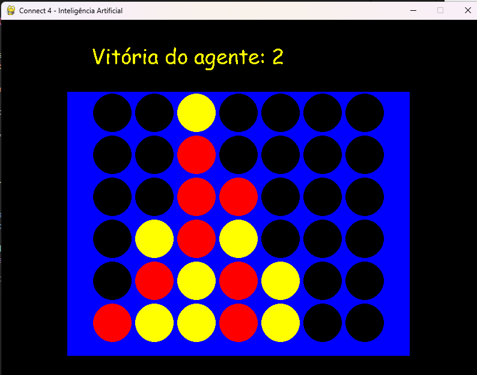

# Connect 4 com IA

Equipe **G**.

**Alunos:** Ana Carolina da Silva, Gustavo Baroni Bruder, Luiz Gustavo Klitzke e Rodrigo Kapulka Franco.

Implementação do jogo Connect 4 em Python com a possibilidade de jogar contra um agente guiado por uma forma básica de Integligência Artificial baseada em um algoritmo de min-max e alpha-beta pruning.

Requisitos de libs disponíveis no arquivo requirements.txt

**Para iniciar o jogo, basta executar o arquivo "connect4.py"**

## Sobre o jogo:

Connect 4 é um jogo de estratégia, jogado por 2 jogadores. 

É um jogo determinístico, pois não depende de sorte, sendo apenas um tabuleiro e depende apenas da estratégia de cada jogador. 

### Regras: 
- O tabuleiro tem 7 colunas e 6 linhas, formando uma grade 7x6.
- Os jogadores alternam colocando fichas em uma coluna de sua escolha.
- O objetivo é conectar 4 de suas fichas vertical, horizontal ou diagonalmente.
- O jogo termina quando um jogador consegue conectar 4 fichas ou quando o tabuleiro fica cheio (empate).

##Algoritmo de busca escolhido
O algoritmo escolhido foi o minimax, mais indicado para jogos determinísticos. 

Para cada estado do tabuleiro, é verificada a lista de possíveis colunas para próximas jogadas e processada uma nova heurística para cada uma, de maneira recursiva, em busca do melhor valor para um determinado agente.

Como podemos ter uma grande quantidade de possível nós para cada estado, foi implementado também o "alpha-beta pruning" para evitar o processamento de nós desnecessários.

A base para a implementação desse algoritmo foi o vídeo ["Algorithms Explained – minimax and alpha-beta pruning"](https://www.youtube.com/watch?v=l-hh51ncgDI&ab_channel=SebastianLague) de Sebastian Lague.

## Heurística

Determinamos o valor da heurística de cada estado somando pontos para a quantidade de grupos de 4 peças que apresentam vantagem para o agente e subtraindo para grupos que quase entreguem a vitória para o adversário.

Verificando outras implementações para esse jogo, calibramos os valores para que o agente seja mais agressivo, apenas perdendo pontos para um estado caso o adversário esteja bem próxima de fechar um grupo de 4 peças e para que esse agente tenha uma pré-disposição para colocar peças na coluna central caso não possua nenhum grupo para aumentar.

A implementação da heurística pode ser vista nas funções “calculaHeuristicaTabuleiro” e “calculaHeuristicaGrupo” presentes no arquivo “agenteIA.py”.
